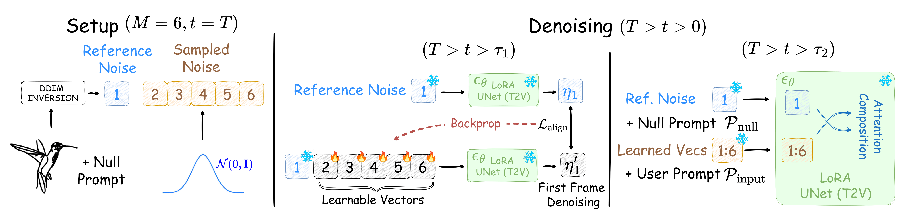
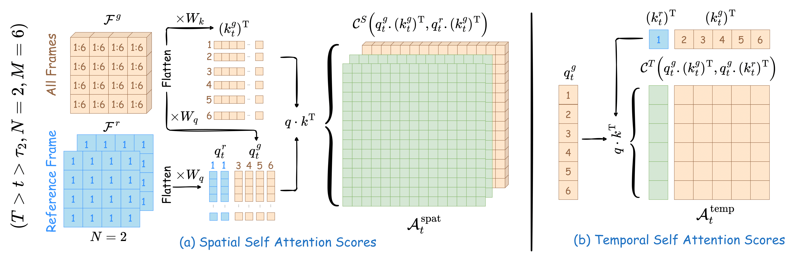

<div align="center" id = "user-content-toc">

  
  # [FlipSketch: Flipping Static Drawings to Text-Guided Sketch Animations](https://hmrishavbandy.github.io/flipsketch-web/)
  []([https://arxiv.org/abs/1234.56789](https://arxiv.org/abs/2411.10818)) [](https://huggingface.co/spaces/Hmrishav/FlipSketch)
 <br>
[Hmrishav Bandyopadhyay](https://hmrishavbandy.github.io/) . [Yi-Zhe Song](https://personalpages.surrey.ac.uk/y.song/)
</div>


https://github.com/user-attachments/assets/de8f2cef-3123-4a98-90e0-af59631a00f4

<div align="center"> 

## ✨ Sketch + Text &#8594; Animation ✨


</div>
<div align="center"> 
  
## 🎥 Gallery 🎥
<div  style="display: flex; flex-wrap: wrap; justify-content: center; gap: 15px; padding: 10px;">
  
  
  
  
  
  
  
  
  
  
</div>
</div>

## 🤗 HuggingFace Demo
Try out our [Hugging Face Space](https://huggingface.co/spaces/Hmrishav/FlipSketch)!

_Powered by ZeroGPU - Special thanks to Hugging Face_ 🙌


## 🚀 QuickStart
- Install conda environment: 
```
conda env create -f flipsketch.yml
```
- Download T2V LoRA Model from HuggingFace
```
git lfs install
git clone https://huggingface.co/Hmrishav/t2v_sketch-lora
```
- Place LoRA checkpoint under root folder:
```
mv t2v_sketch-lora/checkpoint-2500 ./checkpoint-2500/
```
- Run app
```
python app.py
```

## ⚡ PyTorch 2+ Support: 
To use the codebase with PyTorch2.0, modify [here](https://github.com/hmrishavbandy/FlipSketch/blob/7a991e5c657c6da20eba21c13867c5d10324b22f/app.py#L26) to import from `text2vid_torch2.py` instead of `text2vid_modded.py`

## 💡 How it works?

<div align="center">

<p>We use a T2V model fine-tuned on sketch animations, and condition it to follow an input sketch.</p>

<p>We perform attention composition with reference noise from the input sketch.</p>
</div>

## 🙏🏻 Acknowledgements
- [Live-Sketch](https://github.com/yael-vinker/live_sketch)
- [Text-To-Video-Finetuning](https://github.com/ExponentialML/Text-To-Video-Finetuning)
- [Prompt-To-Prompt](https://github.com/google/prompt-to-prompt)
## 📒 Citation
If you find **FlipSketch** useful, consider citing our work: 

```bibtex
@misc{bandyopadhyay2024flipsketch,
  title={FlipSketch: Flipping static Drawings to Text-Guided Sketch Animations}, 
  author={Hmrishav Bandyopadhyay and Yi-Zhe Song},
  year={2024},
  eprint={2411.10818},
  archivePrefix={arXiv},
  primaryClass={cs.GR},
  url={https://arxiv.org/abs/2411.10818}, 
}
